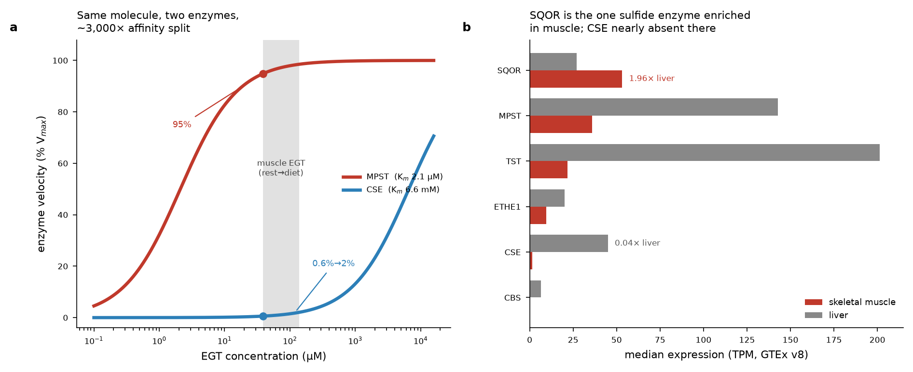

# How ergothioneine makes mice and rats run faster: a new rationale and the first experiment to test it

## The question

Two 2025 *Cell Metabolism* papers show that dietary ergothioneine (EGT/ET) improves endurance in rodents through two different enzymes in two different cell compartments. This document proposes a **new, mechanistically explicit rationale** for the performance benefit that goes beyond restating either paper, and specifies the **single most decisive first experiment** to confirm or kill it.

- **Sprenger et al. 2025**, *Cell Metab* 37:857–869, DOI 10.1016/j.cmet.2025.01.024 ("MPST paper").
- **Petrovic et al. 2025**, *Cell Metab* 37:542–556, DOI 10.1016/j.cmet.2024.12.008 ("CSE paper").

---

## 1. The two established mechanisms

| | **Sprenger — MPST axis** | **Petrovic — CSE axis** |
|---|---|---|
| Uptake | EGT → SLC22A4/OCTN1 (UniProt Q9H015), training-induced via PGC-1α1/PPARα | ET → OCTN1/Slc22a4 (worm *oct-1*) |
| Effector enzyme | **Mitochondrial MPST** (UniProt P25325); EGT is a **sulfur-acceptor/activator** | **Cytosolic CSE/CTH** (UniProt P32929); EGT is an **alternative PLP substrate**, desulfurated |
| Chemical product | pyruvate + low-level H₂S (requires 3-mercaptopyruvate; **no H₂S from EGT alone**) | **hercynine + H₂S** |
| Downstream | ↑ mitochondrial respiration/OXPHOS | H₂S → persulfidation of **cGPDH-Cys243** (GPD1, P21695) → ↑ glycerophosphate shuttle → ↑ cytosolic **NAD⁺** |
| Performance | **male** C57BL/6, voluntary wheel running: **+19%** mean distance/h, **+28%** peak speed, **+14%** cumulative distance | aged (**9-mo male**) Wistar rats, **20 mg/kg** ET in water **3 wk**: **~2×** time and distance to exhaustion; 5-day effect in **both sexes** |
| Causal proof (loss-of-function) | *Mpst⁻/⁻*, I3MT-3, MPST-CRISPR HeLa all abolish | *cth-1*/CSE⁻/⁻, si-CSE, *gpdh-1/2* mutants abolish; inert hercynine does nothing; *mpst-3* dispensable in worms |

**Where they converge:** the same transporter; both generate low-level H₂S; both raise endurance and mitochondrial respiration.
**Where they differ:** compartment (mitochondrial vs cytosolic); enzyme (MPST vs CSE); EGT's chemical fate (an acceptor that is *not* consumed — no hercynine accumulates in mouse muscle — vs a substrate that is desulfurated to hercynine); primary readout (OXPHOS vs cytosolic NAD⁺).
**A constraint any unifying idea must survive:** Sprenger's thermal-proteome screen found CSE unchanged; Petrovic's found MPST *not* a target. Each discovery method was blind to the other's enzyme.

---

## 2. The load-bearing quantitative finding: a ~3,000× affinity partition

The two papers report the affinity of their respective enzyme for the *same* molecule — but in two different papers and two different units, so the comparison has never been made:

- **MPST binds EGT in the low-micromolar range: K_D = 3.2 µM, and releases H₂S with Km = 2.1 µM** (95% CI 1.0–3.8 µM). These values were read directly from the page glyphs (`figures/glyph_MPST_KD.png`, `figures/glyph_MPST_Km.png`) because the automatic text layer of the PDF silently renders the micro sign "µ" as "m"; the same corruption is visible in a sentence that prints "500 µM EGT" as "500 mM EGT" (`figures/glyph_unit_corruption.png`). The micromolar reading is independently forced by biophysics: the calorimetry titrated EGT into 27.5 µM MPST (`figures/glyph_ITC_concentration.png`), and a binding constant is only resolvable by that method when the c-value [E]/K_D lies roughly between 1 and 1000 — here 27.5/3.2 ≈ 8.6 (measurable), whereas at 3.2 mM it would be 0.0086 (unmeasurable). The paper's own "physiologically relevant dose of 10 µM EGT" (`figures/glyph_physiological_dose.png`) agrees.
- **CSE uses EGT in the low-millimolar range: Km = 6.6 mM** (vs 17 mM for its native substrate cysteine; V_max unchanged; catalytic efficiency kcat/Km 0.117 vs 0.046 mM⁻¹s⁻¹). This value is genuinely millimolar — it is printed in a figure table header ("Km (mM)") and on a plot axis, not in corruptible running text, and it is biochemically sensible because ET is a *better* substrate than cysteine.

Placing both on one axis against measured whole-muscle EGT (8.89 ng/mg sedentary ≈ 38.8 µM; ~3.6× higher on the EGT diet ≈ 139.6 µM):

| | MPST (Km 2.1 µM) | CSE (Km 6.6 mM) |
|---|---|---|
| velocity at rest (39 µM) | **~95 % V_max** | **~0.6 % V_max** |
| velocity on EGT diet (140 µM) | ~98.5 % V_max | ~2.1 % V_max |
| change with the diet | **+3.9 %** | **+255 % (×3.6)** |

**The two effector enzymes read the same molecule with affinities ~3,000× apart.** MPST is a **saturated switch** — essentially maxed out at resting muscle EGT, barely moved by more. CSE is a **first-order rheostat** — its flux tracks EGT concentration almost linearly across the entire dietary range. The mouse/MPST result and the dose-responsive aged-rat/CSE result are therefore two operating regimes of one system.

*Left: fractional velocity of MPST (µM Km) and CSE (mM Km) vs EGT; the grey band is the rest→diet muscle EGT range. Right: GTEx v8 median expression, skeletal muscle vs liver, for the sulfide-handling enzymes.*

---

## 3. The new hypothesis

> **Ergothioneine improves endurance by charging the muscle mitochondrial coenzyme-Q (CoQ) pool through SQOR-mediated oxidation of sulfane-sulfur — a convergence point downstream of *both* the mitochondrial-MPST and the cytosolic-CSE axes. SQOR (sulfide:quinone oxidoreductase, UniProt Q9Y6N5) is the muscle node — it is the one sulfide-handling enzyme more abundant in skeletal muscle than in liver — at which the two published mechanisms, and the parallel cGPDH/glycerophosphate-shuttle route that shares the same CoQ electron sink, are integrated. The dietary-EGT dose-response is set upstream by the low-affinity arm (CSE / systemic H₂S) and by free-EGT-gated MPST flux, both of which feed SQOR. EGT is, functionally, a sulfide-fuel charger for the CoQ pool.**

Three independent lines of retrieved evidence point to SQOR as the node:

1. **Expression (GTEx v8).** Among the sulfide-handling enzymes, **SQOR is the only one more abundant in muscle than in liver** (53.2 vs 27.1 TPM, 1.96×). **CSE is nearly absent from muscle** (1.6 vs 44.9 TPM, 0.04×) while MPST is well expressed (35.9 TPM). So in muscle the H₂S *producer* is MPST and the *disposer/harvester* is SQOR; CSE's contribution is likely systemic (hepatic/vascular), not muscle-intrinsic. (SQOR is enriched relative to the other sulfide enzymes, not muscle-restricted — its muscle level ranks 3rd of 18 tissues.)
2. **Network and pathway.** SQOR is functionally wired to both H₂S producers and to the downstream oxidation enzymes (STRING: ETHE1–SQOR 0.993, SQOR–TST 0.952, MPST–SQOR 0.762, CTH–SQOR 0.752), and SQOR/ETHE1/TST constitute the Reactome pathway "Sulfide oxidation to sulfate" (R-HSA-1614517), with MPST and CSE one step upstream. The producer→oxidiser topology is explicit in curated data.
3. **Biochemistry.** Mitochondrial SQOR oxidises H₂S and injects the electrons into the CoQ pool (PMID 25725524); low-level H₂S *stimulates* respiration while high-level H₂S inhibits complex IV, a bell-shaped dose-response (PMID 23991830, 35435014); and human SQOR is itself *activated* by H₂S (PMID 40912653), so it responds dynamically to the sulfide load both EGT axes generate. Human SQOR is a well-characterised flavoenzyme with 8 experimental crystal structures (e.g. 6MO6, 8DHK).

This is consistent with **both** papers' loss-of-function data: SQOR sits *downstream* of MPST and of CSE, so *Mpst⁻/⁻* and CSE⁻/⁻ each still remove their own input to SQOR — neither result is contradicted. The prediction that distinguishes this idea is that removing SQOR should blunt **both** axes at once.

---

## 4. The first pilot experiment

**Aim (one sentence):** determine whether SQOR is required for ergothioneine's endurance benefit, and whether it is the convergence point of the MPST and CSE axes.

### Model and design
- **Animals:** young adult **male C57BL/6J** mice (8–11 wk), matching the voluntary-wheel-running (VWR) model in which the mouse effect was established, for direct comparability. A parallel **female** cohort is run as a secondary arm (short-term effects were reported in both sexes; the mouse VWR work tested only males, so sex is a named gap).
- **Core factorial (2 × 2):** Factor A = **EGT diet** (raising muscle EGT ~3.6-fold, as in the source study) vs matched **control diet**; Factor B = **SQOR-competent** (AAV9-U6-scramble-shRNA) vs **SQOR-knockdown** (AAV9-U6-sh*Sqor*, bilateral hindlimb + low-dose systemic to cover the muscles used in wheel/treadmill running). Timeline: AAV expression 3 wk → diet 6 wk on top → assays (~10–11 wk in-life).
- **Discriminating arms (on the EGT-diet background) — these separate the new mechanism from the two published ones:**
  - **I3MT-3** (MPST inhibitor) — removes the mitochondrial H₂S producer.
  - **propargylglycine / PAG** (CSE inhibitor) — removes the cytosolic/systemic H₂S producer.
  - **inert hercynine** feeding — the published negative control; must give no benefit.
  - **EGT diet + SQOR-knockdown + a low-dose membrane-permeant sulfide donor** (e.g. GYY4137) — tests whether restoring sulfide *downstream* of the producers rescues performance only when SQOR is present.

### Readouts
- **Primary:** incremental treadmill **time-to-exhaustion** and **VWR distance/speed**, baseline-adjusted (ANCOVA on pre-intervention VWR).
- **Mechanistic (on n ≈ 8–10/group subsets):**
  - muscle mitochondrial respiration — **Seahorse OCR** on permeabilised gastrocnemius fibres, with a complex-III-linked protocol and a sulfide-stimulated-respiration assay;
  - **CoQ redox poise** (CoQ/CoQH₂ by LC-MS) — the direct test of "CoQ charging";
  - muscle **H₂S / sulfane-sulfur** (SF7-AM / SSP4) — expected to *back up* when SQOR is knocked down;
  - muscle **NAD⁺/NADH and lactate** — tests the redox-capacity link;
  - **cGPDH-Cys243 persulfidation** (dimedone tag-switch) — tests whether the shuttle route is EGT-dependent and whether it is parallel to or coupled with SQOR;
  - **free intramitochondrial EGT vs whole-tissue EGT** (LC-MS on immuno-isolated mitochondria vs whole muscle) — places free mitochondrial EGT against the MPST Km of 2.1 µM;
  - SQOR-knockdown validation (western blot, target ≥70 % protein reduction; confirmed with a second independent shRNA).

### Sample size and power
Detecting the reported **+19 %** distance change at a VWR coefficient of variation ~18 % (α 0.05, power 0.8) needs **n = 16/group** (Cohen d ≈ 1.06). The decisive test, however, is the **EGT × SQOR interaction** (does knocking down SQOR remove the EGT gain?); a difference-of-differences carries ~√2 the variance, so the interaction is powered at **n = 24/group** (2 × 2 core = **96 mice**), with baseline VWR as an ANCOVA covariate (typically cuts residual variance 30–40 %). Mechanistic assays run on 8–10/group subsets; the pharmacological arms at n = 12/group (powered for the larger, near-complete abolition effects).

### Quantitative prediction — hypothesis vs null
- **Under the hypothesis:** EGT raises treadmill distance ~**+19 %** in SQOR-competent mice, and this increment falls to **0 ± ~5 %** in SQOR-knockdown mice → a **significant EGT × SQOR interaction (p < 0.05)**. I3MT-3 and PAG each *partially* reduce the EGT benefit (each removes one sulfide source); SQOR-knockdown removes it *most completely* (the shared node). The CoQ pool becomes more reduced (↑ CoQH₂/CoQ) EGT-dependently only when SQOR is present; complex-III-linked OCR rises ~20–30 % EGT- and SQOR-dependently; muscle H₂S/sulfane rises under SQOR-knockdown; the EGT-driven NAD⁺ rise and lactate drop are SQOR-dependent.
- **Under the null:** EGT raises distance ~+19 % **equally** in SQOR-competent and SQOR-knockdown mice (no interaction); SQOR-knockdown may lower baseline uniformly but does not touch the EGT increment.

### The specific falsifying result
**If EGT improves treadmill time-to-exhaustion by ≥15 % in SQOR-knockdown muscle to the same degree as in SQOR-competent muscle — interaction p > 0.2, with the SQOR-knockdown EGT-effect 95% CI excluding zero and overlapping the SQOR-competent estimate — the hypothesis is falsified.** That outcome would return the mechanism to a SQOR-independent route (MPST→pyruvate carbon, or cGPDH→NAD⁺ acting without the CoQ convergence).

### Confounds and controls
- **Incomplete/off-target knockdown** → scramble-shRNA control, ≥70 % protein-level validation, second independent shRNA.
- **SQOR-knockdown raising H₂S to complex-IV-inhibiting levels** (a performance effect independent of EGT) → use *partial* knockdown, measure muscle H₂S, and include the SQOR-knockdown + control-diet cell in the factorial.
- **EGT-diet effects on intake/body mass** → pair-feeding or intake logging; report body mass; confirm by LC-MS that muscle EGT rose equally regardless of SQOR status (rules out a transporter/uptake artifact).
- **VWR motivation / central-nervous-system component** (a central contribution was not excluded in the mouse work) → forced treadmill as a convergent readout.
- **AAV inflammation** → empty-capsid and injection-only controls; histology.
- **Free-vs-total EGT interpretation** → the isolated-mitochondria LC-MS arm is what licenses any statement about MPST occupancy; no occupancy claim is made without it.

### Feasibility
AAV9-shRNA intramuscular delivery, defined diets, VWR/treadmill, Seahorse respirometry, LC-MS (EGT, CoQ, NAD⁺), tag-switch persulfidation, and western blotting are all standard. End-to-end ~3–4 months.

---

## 5. Caveats and open items
- **Free vs total EGT.** The 39 µM resting figure is whole-tissue *total*; free intramitochondrial EGT is unmeasured and is an upper bound. Whether MPST is truly saturated *in situ* is exactly what the isolated-mitochondria LC-MS arm resolves.
- **SQOR is muscle-*enriched*, not muscle-*specific*.** It is the only sulfide enzyme with muscle > liver, but across tissues its muscle level ranks 3rd (behind whole blood and lung). The claim is relative enrichment among sulfide enzymes, not restricted expression.
- **SQOR in the persulfidome is unconfirmed.** Whether SQOR itself is an EGT-responsive/persulfidated protein in the published datasets could not be resolved through the data connector (no protein-level rows returned) and needs the papers' supplementary tables. SQOR's activation by H₂S is, however, independently established (PMID 40912653).
- **Coupling of SQOR with the glycerophosphate shuttle** (a shared CoQ electron sink) is a mechanistic proposal; the pilot's CoQ-redox and cGPDH-persulfidation arms are what would test it.
