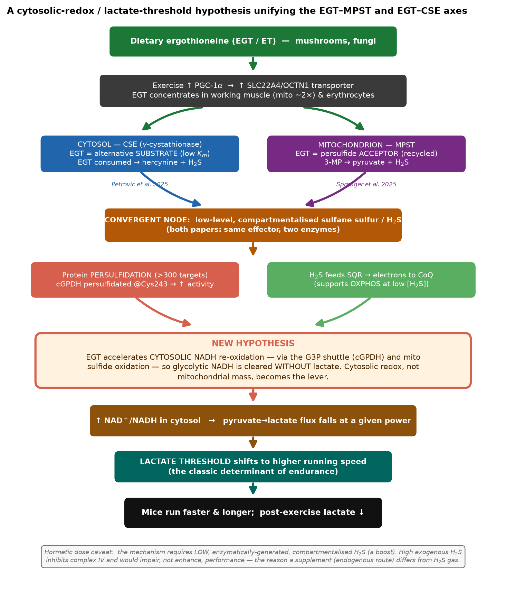
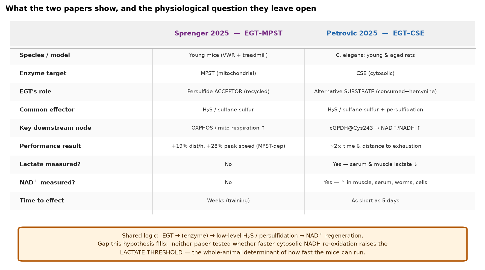
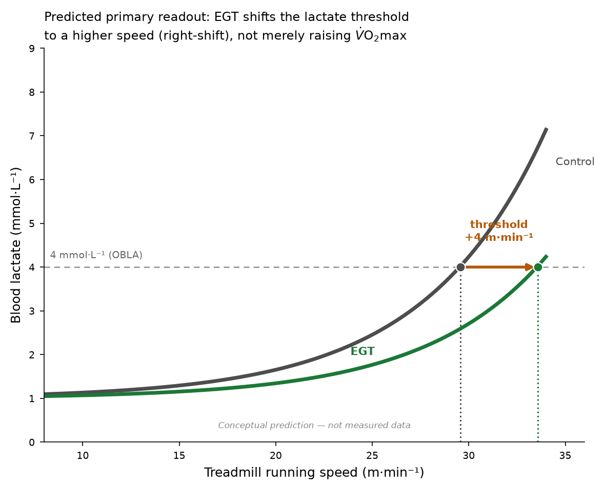
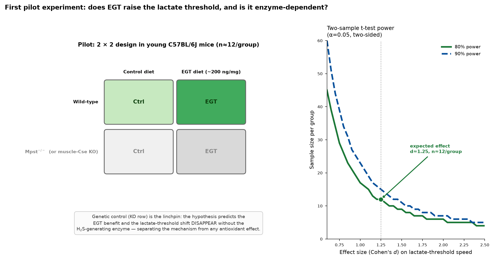

# A new rationale for why ergothioneine makes mice and rats run faster

**One-sentence hypothesis.** Ergothioneine (EGT) does not primarily "build better mitochondria" — it accelerates **cytosolic NADH re-oxidation**. By feeding low-level, enzymatically-generated hydrogen sulfide (H₂S) and protein persulfidation into the glycerol‑3‑phosphate (G3P) shuttle, EGT lets working muscle regenerate cytosolic NAD⁺ fast enough to keep clearing pyruvate **aerobically instead of converting it to lactate**. The measurable consequence is a **rightward shift of the lactate threshold** — the single best-established physiological determinant of endurance running speed. That is the lever that makes the animals run faster and longer.

---

## Why this is a genuinely new idea (and not just a restatement of the two papers)

Both provided papers land on the *same molecular effector* from two directions but **neither connects it to a whole-animal exercise-physiology variable**:

- **Sprenger et al. 2025 (EGT–MPST).** Exercise concentrates EGT ~2-fold in muscle *mitochondria*; EGT binds mitochondrial **MPST** as a persulfide **acceptor** and raises H₂S, boosting mitochondrial respiration. An EGT diet raised running distance/h by ~19% and peak speed by ~28%, and this was **abolished in *Mpst*⁻/⁻ mice**. They frame the output as *mitochondrial respiration / OXPHOS*.
- **Petrovic et al. 2025 (EGT–CSE).** In worms and rats, EGT is an alternative **substrate** for cytosolic **CSE**, generating H₂S and persulfidating >300 proteins. The decisive node is **cGPDH persulfidated at Cys243 → higher activity → higher NAD⁺/NADH → lower lactate**, with ~2× endurance in rats. They frame the output as *NAD⁺-driven rejuvenation*.

The two papers **disagree on the enzyme (mitochondrial MPST vs cytosolic CSE), on EGT's chemical fate (recycled vs consumed), and on the "headline" downstream node (OXPHOS vs cytosolic NAD⁺).** My hypothesis reconciles all three by shifting the level of explanation:

> The relevant output is not *how much* ATP the mitochondria can make (capacity) but **how fast the cytosol can hand its reducing equivalents to the mitochondrion without spilling them into lactate** (redox flux). Both the MPST route (mitochondrial H₂S → SQR → electron transport, keeping the matrix NADH sink open) and the CSE route (persulfidation-activated cGPDH, the cytosolic arm of the G3P shuttle) **push the same shuttle harder**. The whole-animal readout of a faster cytosolic-NADH sink is a **higher lactate threshold** — something *neither paper measured in the running animal.*

This reframing is supported by the one hard physiological clue the papers already contain but did not follow up: **Petrovic's rats had lower serum *and* muscle lactate after exercise** while running twice as far. Lower lactate at higher work output is the textbook signature of a lactate-threshold shift — not of a bigger VO₂max alone.

---

## The mechanistic chain, stated as falsifiable steps

1. During exercise, PGC‑1α raises SLC22A4/OCTN1, concentrating EGT in working muscle (and it is already high in erythrocytes).
2. EGT drives **low-level, compartmentalised** sulfane-sulfur/H₂S production through **both** MPST (mitochondrial) and CSE (cytosolic).
3. This does two redox-relevant things at once: (a) **persulfidation of cGPDH at Cys243 raises its activity**, speeding the cytosolic (NAD⁺-generating) arm of the G3P shuttle; (b) **H₂S donates electrons via sulfide:quinone oxidoreductase (SQR)** into the CoQ pool, keeping the mitochondrial NADH/FADH₂ sink open.
4. Net effect: **cytosolic NAD⁺/NADH rises**, so glyceraldehyde‑3‑phosphate dehydrogenase (GAPDH) keeps running and **pyruvate is oxidised rather than reduced to lactate** at any given running speed.
5. The lactate–speed curve shifts right: the mouse can sustain a **higher speed before lactate accumulates**, which is exactly what "runs faster / longer" means at the level of exercise physiology.

**Critical caveat, built into the hypothesis (hormesis).** This works *only* because the H₂S is low, enzyme-made, and compartmentalised. High exogenous H₂S inhibits complex IV and would *impair* performance. This is why an EGT *supplement* (which raises the endogenous, enzyme-gated route) behaves differently from breathing H₂S — and it makes a sharp, testable dose prediction (below).

---

## The core prediction the pilot will test

If the hypothesis is right, EGT-fed animals show a **lactate–speed curve shifted to higher speed** (a higher velocity at the fixed 4 mmol·L⁻¹ "OBLA" reference), **without necessarily a matched rise in VO₂max**. A pure "more/better mitochondria" model predicts the opposite emphasis (VO₂max up, curve shape largely preserved). The two models are therefore distinguishable in one treadmill assay.

---

## First pilot experiment

**Question:** Does dietary EGT raise the lactate threshold in running mice, and is that shift dependent on the H₂S-generating enzyme (not on antioxidant chemistry)?

**Design — a 2 × 2, enzyme-controlled treadmill lactate-threshold assay.**

| | Control diet | EGT diet (~200 ng/mg, as in Sprenger) |
|---|---|---|
| **Wild-type** | n≈12 | n≈12 |
| ***Mpst*⁻/⁻** (or muscle-specific *Cse* KO) | n≈12 | n≈12 |

- **Species/strain:** young male + female C57BL/6J (include both sexes — Sprenger used only young males and flagged this as a limitation).
- **Intervention:** 2 weeks pre-feeding + during, matching the diet already validated in Sprenger; a parallel **5-day** arm is worth adding because Petrovic saw performance gains that fast.
- **Primary endpoint:** **lactate threshold velocity** from an incremental treadmill ramp — tail-blood lactate sampled at each stage, threshold taken as the speed at 4 mmol·L⁻¹ (and by the log-log breakpoint method). This is the readout neither paper collected in running mice.
- **Secondary endpoints (mechanistic bridge):** time/distance to exhaustion; post-exercise blood + gastrocnemius lactate; muscle **NAD⁺/NADH**; muscle **cGPDH persulfidation (Cys243)** and cGPDH activity; muscle **H₂S/sulfane-sulfur**. These tie the whole-animal shift back to the molecular node.

**The decisive contrast is the KO row.** The hypothesis predicts the EGT-induced lactate-threshold shift is **present in wild-type and abolished in the enzyme KO**. If EGT still shifts the threshold in the KO, the mechanism is *not* the H₂S/persulfidation axis (e.g. it is antioxidant), and the hypothesis is falsified. Because Sprenger already showed the *performance* benefit is MPST-dependent, this design tests whether the *lactate-threshold* readout rides on the same gene — the specific new claim.

**Power.** Taking a conservative expected effect (a ~15% rise in lactate-threshold speed against a ~12% between-animal CV → Cohen's *d* ≈ 1.25), **n ≈ 12 per group gives 80% power** (n ≈ 15 for 90%) at two-sided α = 0.05. Even a smaller effect (d ≈ 0.67) is covered by ~37/group — feasible for a definitive follow-up.

**Go / no-go.** *Go* if wild-type EGT animals show a significant right-shift in lactate-threshold velocity that is absent in the enzyme KO, with the predicted rise in muscle NAD⁺/NADH and cGPDH-C243 persulfidation. That result would establish — for the first time — *which physiological variable* the EGT→H₂S axis actually moves to make animals run faster, and would unify the MPST and CSE findings under a single, measurable mechanism.

---

### Files in this folder
- `result.md` — this document (the hypothesis and the case for it).
- `reasoning.md` — how I got here, including alternatives considered and how they were excluded.
- `figures/` — four labelled figures (schematic, predicted readout, two-paper synthesis, pilot design + power) with a caption file.
- `sources.md` — every source with identifiers (DOIs / PRIDE / BioProject / URLs).
- `process_trace.json` — step-by-step record of what I actually did.
