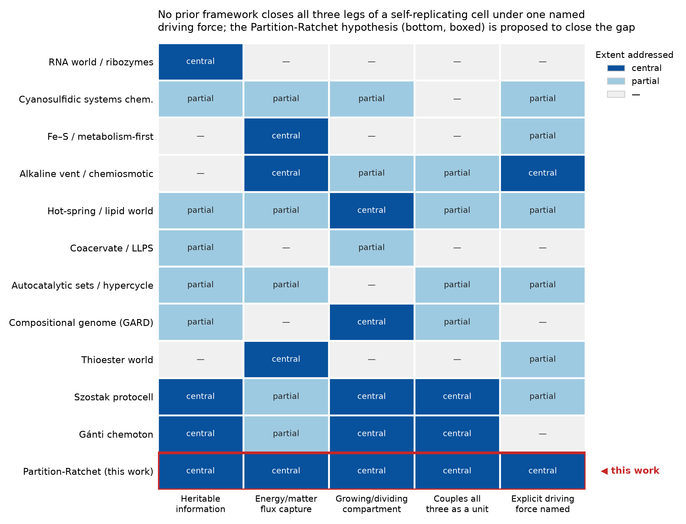
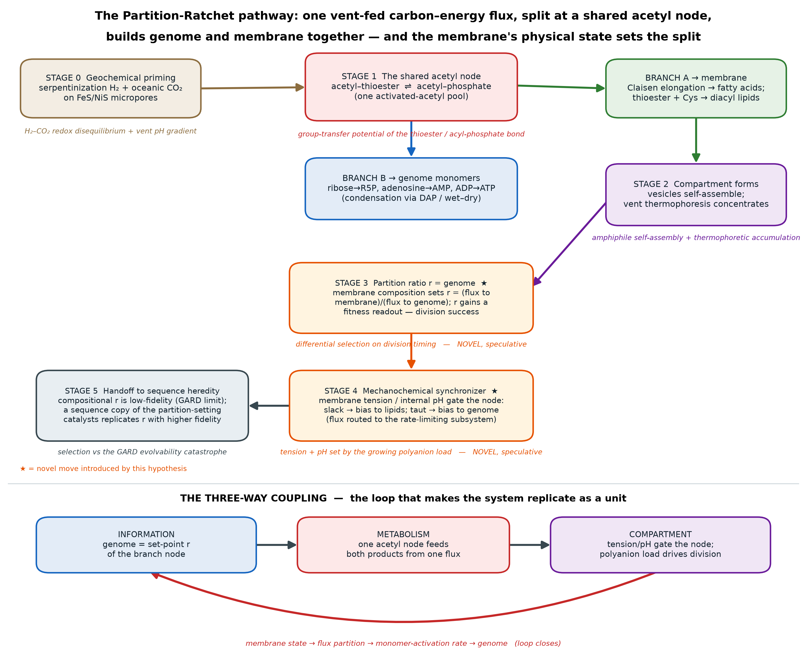

# The Partition-Ratchet Hypothesis
### How a lifeless organic mixture could have organized into the first self-replicating cell

---

## The hypothesis in brief

**The Partition-Ratchet hypothesis.** I propose that the first heritable, selectable piece of information was neither a nucleotide sequence nor a bare lipid composition, but the **flux-partition ratio at a shared acetyl-thioester / acetyl-phosphate node** — the fraction of a vent-fed carbon–energy flux that a protocell routes into *membrane synthesis* versus *genome-monomer activation*. This ratio *r* is physically stored in the protocell's membrane composition (which mineral/peptide catalysts and amphiphiles are present) and is *read out* as whether the cell grows, stalls, or divides — giving compositional inheritance the fitness handle it has always lacked. Because the same node's two branches build the boundary and activate the genome from one geochemical flux, and because the partition is gated by the cell's own membrane tension and internal pH, replication-as-a-whole becomes a **self-synchronizing attractor**: flux is automatically steered toward whichever subsystem is rate-limiting for the next division. Sequence heredity then emerges not to invent the recipe *de novo*, but to *stabilize* an already-selectable metabolic-partition phenotype against the loss of information intrinsic to compositional inheritance. The system is held far from equilibrium by the serpentinization-derived H₂–CO₂ redox disequilibrium of an alkaline hydrothermal vent.

**The one-sentence novelty:** four quantities the field treats separately — Gánti's postulated coupling coefficient, the flux-partition ratio of a shared metabolic currency, the compositional "genome," and the trait that selection acts on — are proposed to be **one physically-instantiated, evolvable variable**, and the protocell's own membrane mechanics are what keep genome replication and compartment division in step.

---

## 1. The gap this resolves

Three-and-a-half decades of origin-of-life research have produced deep accounts of each *separate* requirement for a living cell, but the requirements have never been welded into one autonomously reproducing unit. A self-replicating cell needs three things at once: **(i)** heritable information, **(ii)** capture of an energy/matter flux, and **(iii)** a compartment that grows and divides — and, decisively, a mechanism by which these three reproduce *together*.

The comparison figure below scores each major framework against those three legs plus two further tests — does it couple all three as a unit, and does it name an explicit thermodynamic driving force?

*Figure 1. No prior framework closes all three legs of a self-replicating cell under one named driving force. "central" = the framework's core strength; "partial" = addressed but assumed, imported, or external; "—" = not addressed. Scoring rationale and the underlying table are in `figures/camp_comparison_table.csv`.*

The reading is consistent: the RNA-world and ribozyme programs solve information and catalysis but supply activated monomers and a compartment from outside — even the demonstrated prebiotic synthesis of activated pyrimidine ribonucleotides is a surface-chemistry result, not an autonomous cell (Gilbert 1986, DOI 10.1038/319618a0; Cech 1987, PMID 3323479; Powner et al. 2009, PMID 19444213). Metabolism-first and iron–sulfur-world chemistry powers carbon fixation but has no heredity and provably caps evolvability (Wächtershäuser 2006, PMID 17008219). The alkaline-vent / chemiosmotic program supplies a sustained energy source from a natural proton gradient and connects directly to the reconstructed physiology of the last universal common ancestor, which was anaerobic, H₂-dependent, CO₂-fixing and rich in FeS chemistry (Martin & Russell 2003, DOI 10.1098/rstb.2002.1183; Lane, Allen & Martin 2010, DOI 10.1002/bies.200900131; Weiss et al. 2016, PMID 27562259) — but it faces the "leaving-home" problem: a closed organic membrane is comparatively proton-tight, so a protocell that buds off a mineral pore loses access to the free geochemical gradient and appears to need a pre-evolved pump. Szostak-type fatty-acid protocells couple genome to division elegantly through an osmotic mechanism (Chen, Roberts & Szostak 2004, PMID 15353806; Zhu & Szostak 2009, PMID 19323552) — but feed *both* nucleotides and lipids from outside, and the rate-matching between replication and division is imposed rather than explained. Compositional-genome (GARD) models give heritable composition but cannot evolve open-endedly (Segré, Ben-Eli & Lancet 2000, PMID 10760281). Gánti's chemoton formalizes exactly the three-subsystem coupling required, but its coupling coefficients are postulated, not derived.

**Two tensions remain open even after granting each camp its strength:**

1. **Synchronization is a free parameter.** Protocell growth-and-division models require the genome-replication rate and the membrane-growth rate to match, or the cell dilutes itself to death or bursts. In current models this balance is inserted by hand: a recent computational protocell study makes membrane growth depend on *external* lipid concentration and membrane tension and treats the balanced metabolic state as a modelled outcome of an assumed lipid supply (Taneja & Higgs 2025, DOI 10.3390/life15050724). No one gives a *physical reason* the two rates should track each other.
2. **The compositional genome has no fitness readout.** Compositional inheritance is heritable but demonstrably cannot support the open-ended evolution life requires (Vasas, Szathmáry & Santos 2010, PMID 20080693). A count of molecular species self-templates, but selection has nothing quantitative to grip.

**The Partition-Ratchet hypothesis targets precisely these two tensions**, and it does so with a single move: make the compositional genome *physically control* the branch point of a shared metabolic currency, so that (a) composition acquires a fitness readout — division timing — and (b) synchronization becomes an automatic consequence of the protocell's own physical state rather than an assumed constant.

---

## 2. The prebiotic setting

**Environment (established).** A Hadean alkaline hydrothermal vent: warm (~40–90 °C) H₂-rich alkaline fluid from serpentinization mixing with cooler, more acidic, CO₂- and metal-bearing ocean water across thin FeS/NiS-lined mineral micropores, which sustain natural redox and pH gradients (Russell & Hall 1997, DOI 10.1144/gsjgs.154.3.0377; Martin et al. 2008, DOI 10.1038/nrmicro1991; Sojo et al. 2016, PMID 26841066). This is the setting most consistent with the inferred physiology of the last universal common ancestor (Weiss et al. 2016, PMID 27562259).

**Energy source (established).** The redox disequilibrium between serpentinization-derived H₂ and oceanic CO₂/oxidants — the same couple used by the deepest-branching autotrophs today. A hydrogen-dependent geochemical analogue of core carbon-and-energy metabolism runs abiotically under these conditions (Preiner et al. 2020, DOI 10.1038/s41559-020-1125-6).

**Starting molecules and their provenance (established, except where noted):**

| Molecule | Prebiotic source | Reference |
|---|---|---|
| CO, methanethiol, acetyl-thioesters | Geoelectrochemical CO₂ reduction on Ni/Fe sulfides | Kitadai et al. 2021, DOI 10.1038/s42004-021-00475-5 |
| Acetate, pyruvate, other acids | H₂-driven CO₂ fixation on native metals/minerals | Muchowska et al. 2019, DOI 10.1038/s41586-019-1151-1; Preiner et al. 2020 |
| Acetyl phosphate | Thioacetate + phosphate in water | Whicher et al. 2018, PMID 29502283 |
| Fatty acids / single-chain amphiphiles | Vent Fischer–Tropsch-type synthesis; mixed-amphiphile vesicles stable under vent conditions | Jordan et al. 2019, DOI 10.1038/s41559-019-1015-y |
| Diacyl lipids | Spontaneous cysteine + short-chain thioester reaction | Cho et al. 2024, PMID 39478161 |
| Fe–S clusters, short peptides | Prebiotic assembly on minerals / under UV | Bonfio et al. 2017, DOI 10.1038/nchem.2817 |
| Nucleotide precursors, phosphorylation | Acetyl phosphate; diamidophosphate (DAP) | Whicher et al. 2018; Gibard et al. 2017, PMID 29359747 |

---

## 3. The staged pathway

*Figure 2. The Partition-Ratchet pathway. One vent-fed flux is activated at a shared acetyl node (Stage 1); the node's two branches build the membrane (A) and activate genome monomers (B); the compartment forms and concentrates (Stage 2); the membrane composition then sets the branch ratio r and gives it a fitness readout (Stage 3, novel); membrane tension/pH feed back on the node to synchronize the subsystems (Stage 4, novel); and sequence heredity is recruited to stabilize r (Stage 5). The bottom band shows the three-way coupling loop. ★ marks the novel moves.*

**Stage 0 — Geochemical priming.** *Driving force: H₂–CO₂ redox disequilibrium + the vent pH gradient.* On FeS/NiS surfaces, CO₂ is reduced through CO/formate to acetyl groups captured as **acetyl-thioesters**; a fraction reacts with inorganic phosphate to give **acetyl phosphate** (Kitadai et al. 2021; Whicher et al. 2018; Preiner et al. 2020). *Established chemistry.*

**Stage 1 — The shared acetyl node forms.** *Driving force: the high group-transfer potential of the thioester / acyl-phosphate bond.* A single activated-acetyl pool (acetyl-thioester ⇌ acetyl-phosphate) can donate its acetyl or phosphoryl group to distinct sinks: **(A)** lipid synthesis — Claisen-type C–C elongation toward fatty acids, or the demonstrated cysteine + short-chain-thioester route to diacyl lipids (Cho et al. 2024); and **(B)** monomer activation — phosphorylation of ribose to ribose-5-phosphate, adenosine to AMP, and ADP to ATP (Whicher et al. 2018). *The node's existence and both product branches are established; that they draw on one shared pool in a protocell is a reasonable inference.*

**Stage 2 — Compartment appears and concentrates.** *Driving force: amphiphile self-assembly (hydrophobic effect) + vent thermophoresis.* Branch-A lipids self-assemble into vesicles; the vent's thermal gradient concentrates solutes in the pores by orders of magnitude, defeating the dilution problem (Baaske et al. 2007, DOI 10.1073/pnas.0609592104). *Established.*

**Stage 3 — The partition ratio becomes the first genome. [NOVEL — speculative]** *Driving force: differential selection on division timing.* A protocell's membrane composition (its complement of catalysts and amphiphiles) sets the partition ratio **r = (flux to membrane) / (flux to genome activation)**. A cell with a well-tuned *r* grows its boundary and its internal polyanion load in step and divides cleanly; a mistuned *r* either dilutes its contents or bursts before dividing. Because membrane composition is inherited GARD-style through physical splitting at division (Segré et al. 2000; Lancet et al. 2018), and because *r* now carries a **fitness readout — division success — that bare compositional inheritance lacks** (Vasas et al. 2010), selection can finally act on it. *This is the core novel claim; the labeled leap is that membrane composition/state gates the node's partition.*

**Stage 4 — Mechanochemical self-synchronization. [NOVEL — speculative]** *Driving force: membrane tension and internal pH, both set by the growing polyanion load.* As branch-B monomers polymerize into a polyanionic genome, osmotic influx raises internal pressure and membrane tension — the osmotic ratchet by which encapsulated RNA "exerts an osmotic pressure on the vesicle membrane that drives the uptake of additional membrane components," so that more efficient replication drives faster growth at the expense of relaxed neighbours (Chen, Roberts & Szostak 2004, PMID 15353806). I propose the *same* tension feeds back on the branch node: a slack membrane (just after division) biases flux toward lipid synthesis; a taut membrane (approaching division) biases flux toward genome activation. Flux is thereby routed automatically to whichever subsystem is rate-limiting, so synchronization *emerges from the physics of the growing cell* instead of being an imposed constant. *Labeled leap: tension/pH modulation of the acetyl branch ratio.*

**Stage 5 — Handoff to sequence heredity.** *Driving force: selection against the evolvability catastrophe of compositional inheritance.* Compositional inheritance of *r* is low-fidelity and caps evolvability (Vasas et al. 2010). Any lineage that stumbles onto a **sequence** encoding of the partition-controlling catalyst set replicates *r* at higher fidelity and out-competes purely compositional lineages. Sequence heredity is thus recruited to *stabilize a metabolic phenotype already under selection*, consistent with a monomer-biochemistry era preceding polymers (Whicher et al. 2018) and with models in which heredity originates in autotrophic, FeS-bearing protocells (West et al. 2017, PMID 29061892). The genome-monomer condensation this requires is supplied by chemistry the acetyl node does not itself provide — diamidophosphate both phosphorylates *and* oligomerizes nucleosides, peptides and lipid precursors in water (Gibard et al. 2017, PMID 29359747).

---

## 4. The three-way coupling, made explicit

The reason the system reproduces *as a unit* — rather than as three separate stories — is a single closed loop (bottom band of Figure 2):

- **Information ↔ metabolism.** The genome — first the partition ratio *r* held in membrane composition, later a sequence copy of it — *is* the set-point of the metabolic branch node. Change the genome and you change the flux partition; change the flux partition and you change which genome gets built. They are the same variable viewed two ways.
- **Metabolism ↔ compartment.** One acetyl node feeds both membrane lipids and genome monomers from one geochemical flux; the boundary is literally built from the metabolism's product.
- **Compartment ↔ information.** Membrane tension and pH (the compartment's physical state) gate the node (metabolism), which sets the monomer-activation rate (information); and the polyanionic genome's osmotic load is what drives the tension that divides the compartment. **The loop closes: the physical act of growing toward division is what re-partitions the flux to refill the genome.**

---

## 5. What is new, stated plainly

Much of the *chemistry* invoked here is not mine and is credited as such: the shared acetyl-phosphate energy currency and its coupling of carbon and energy flux belong to de Duve (PMID 14601926) and to the Lane group (Whicher et al. 2018, PMID 29502283; Pinna et al. 2022, PMID 36194581); the thioester-to-membrane branch is Devaraj and Chen's demonstrated chemistry (Cho et al. 2024, PMID 39478161); the osmotic ratchet is Szostak's (Chen et al. 2004; Zhu & Szostak 2009). The novelty is in the **coupling and the ordering**, not the ingredients:

- **Versus the thioester / acetyl-phosphate currency (de Duve; Lane).** I do not claim the shared currency. I claim that its **partition ratio is the first genome** — the energy currency becomes the substrate that a heritable set-point meters. That reframing is absent from the currency literature, which treats acetyl phosphate as an energy source, not as an information-bearing control variable.
- **Versus the chemiosmotic vent (Russell; Lane; Martin).** I relocate autonomy from a *maintained* proton gradient to a **membrane-state-gated flux partition**, sidestepping the "leaving-home" pump requirement. (I note honestly that fatty-acid membranes can hold ATP-synthesizing proton gradients under steep pH/temperature conditions — Yu et al. 2025, PMID 40123866 — so gradient use is a viable alternative route; my synchronizer does not depend on which energy-transport route operates.)
- **Versus GARD (Segré; Lancet).** I give compositional inheritance the **fitness readout — division timing — it provably lacks** (Vasas et al. 2010), by making composition control metabolic flux rather than merely self-template.
- **Versus the Szostak protocell.** Both lipids and monomer activation come from **one internal geochemical node**, and division is **auto-synchronized by membrane state**, not set by external feeding or applied shear.
- **Versus the Gánti chemoton.** The coupling coefficient is **derived, evolvable, and physically grounded** in membrane mechanics, not postulated.

A creative synthesis that resolves a standing tension counts as novel. The standing tension here is real and named — synchronization-as-free-parameter and the compositional-genome fitness gap — and the resolving move (partition-ratio-as-genome, mechanochemically synchronized) is not a restatement of any single camp.

---

## 6. Falsifiable predictions and the kill criterion

**Bench experiments.**
1. **Partition-gating (the crux test).** In FeS/NiS-catalyzed vesicles fed thioacetate/acetyl-phosphate, impose membrane tension (osmotic swelling or micropipette aspiration) and measure the product ratio of lipid synthesis versus nucleotide/ADP phosphorylation by ³¹P-NMR and LC-MS across graded osmolarity. *Prediction:* taut membranes shift flux toward monomer phosphorylation; slack membranes shift it toward lipid synthesis.
2. **Auto-synchronization.** Co-encapsulate the acetyl node with an activatable genome analogue; protocells with a tuned *r* should sustain repeated grow-divide cycles without death-by-dilution, whereas cells with an externally-fixed *r* should not.
3. **Heredity handoff.** A sequence-encoded catalyst that biases *r* should out-propagate a compositional-only lineage over successive generations.

**Geological record.** Vent-hosted FeS/NiS precipitates should carry carbon-isotopic and acetyl/thioester signatures consistent with abiotic acetyl chemistry; Kitadai et al. 2021 establishes the chemistry is feasible under such conditions.

**Fingerprints in extant biochemistry (independently verified in this work).** The hypothesis predicts a conserved thioester ⇌ acyl-phosphate ⇌ phosphoanhydride relay at the root of metabolism. It is present and ancient: **phosphotransacetylase** (Pta, UniProt P0A9M8, EC 2.3.1.8; "phosphate acetyltransferase activity," experimental evidence code IDA) and **acetate kinase** (AckA, UniProt P0A6A3, EC 2.7.2.1; "acetate kinase activity," IDA) interconvert acetyl-CoA ⇌ acetyl-phosphate ⇌ acetate + ATP; **CO-dehydrogenase / acetyl-CoA synthase** (UniProt P27988, EC 2.3.1.169) makes the acetyl-thioester in the Wood–Ljungdahl pathway; Reactome places the acetyl/thiolase hub at the core of the TCA cycle (R-HSA-71403). The acetyl-CoA pathway is independently argued to predate genes (Martin 2020, DOI 10.3389/fmicb.2020.00817; Weiss et al. 2016).

**The kill criterion.** If membrane physical state (tension/pH) demonstrably **cannot** bias the acetyl node's partition between lipid synthesis and monomer activation — i.e. the branch ratio is set purely by bulk concentrations and is invariant to compartment state across the plausible parameter range — then the mechanochemical synchronizer (Stages 3–4) fails, and the hypothesis collapses to the already-published shared-currency picture with no novel content.

---

## 7. The single weakest link

The load-bearing leap is **Stage 3–4: that membrane tension/pH gates the acetyl branch point.** Membrane mechanosensitivity is real in modern biology, but that a mineral/peptide-catalyzed acetyl branch responds to bilayer tension in a protocell has never been demonstrated; it is my speculation, not established fact, and prediction #1 is designed to test exactly it.

Two secondary weak links, stated honestly:
- **Activation is not condensation.** Acetyl phosphate phosphorylates monomers but does **not** itself polymerize them: Whicher et al. (2018) report that acetyl phosphate "did not polymerise either amino acids or nucleotides in water." The node supplies activation; genome *condensation* must be imported (diamidophosphate or wet–dry cycling; Gibard et al. 2017). This is a dependency, not a fatal gap, but it means the pathway is not self-contained in one chemistry.
- **The energy budget is tight.** Thioester synthesis is strongly exergonic (~−59 kJ mol⁻¹) yet, as Preiner et al. (2019, PMID 31641438) note, substrate-level phosphorylation from the acetyl-CoA pathway alone is insufficient to make ATP — which is exactly why extant acetogens and methanogens supplement it with ion-gradient (chemiosmotic) coupling. A purely portable-thioester energy economy may therefore not close the budget without some gradient use.

**Not addressed here.** Homochirality is treated as an orthogonal problem this hypothesis does not solve; I make no claim about its origin.

---

*Full source-to-claim mapping is in `sources.md`; the reasoning path and the novelty argument are in `reasoning.md`; the machine-readable action log is in `process_trace.json`.*
