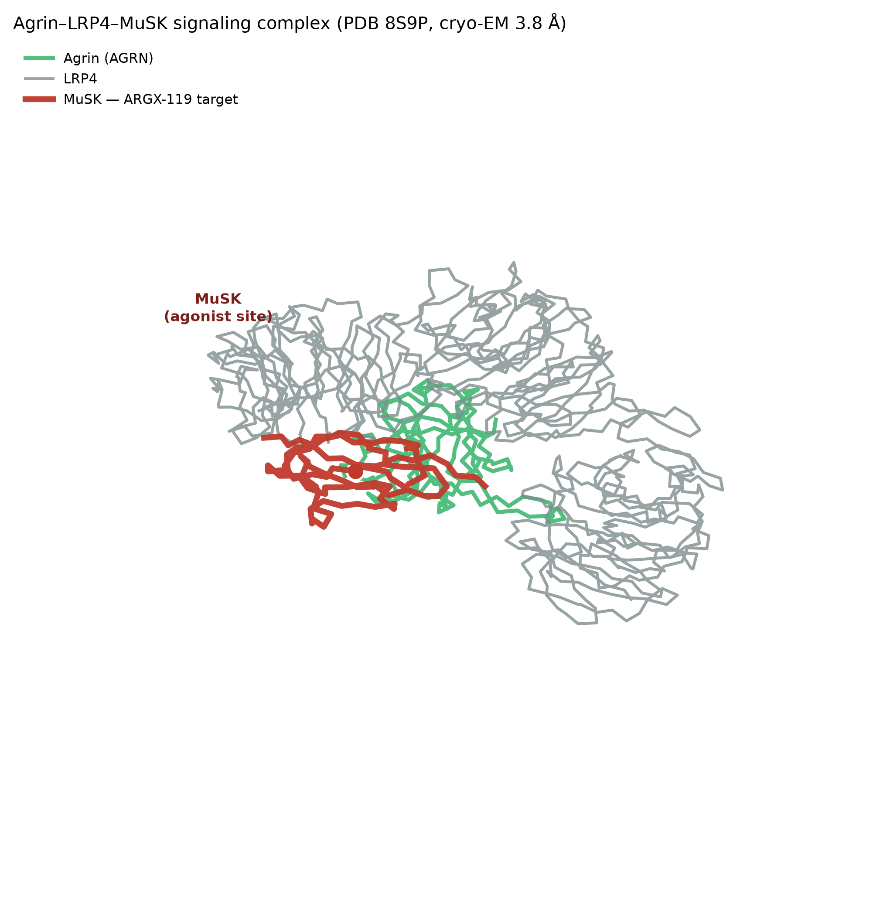

# A neuromuscular-junction exercise mimetic for sarcopenia: MuSK agonism with ARGX-119 (adimanebart)

## The proposal in one sentence

**ARGX-119 (INN: adimanebart)** — a first-in-class humanized agonist monoclonal antibody against **muscle-specific kinase (MuSK)** — is proposed as an **exercise mimetic for age-related sarcopenia**, acting by restoring agrin→MuSK signaling at the neuromuscular junction (NMJ) *downstream* of the specific molecular lesion that drives age-related denervation.

The compound is real and clinically advanced (ChEMBL CHEMBL6068571; phase 2; five registered trials). What is new is the **connection**: no prior work proposes a MuSK agonist — or any NMJ-stabilizing agent — as an exercise mimetic for sarcopenia. The target's benefit in exercise-trained muscle, its dysregulation in aged muscle, and the compound's correct-direction mechanism are each grounded in public data below.

---

## Why the neuromuscular junction, and why MuSK

Two independent human transcriptomic signatures, built on a shared 60-gene panel spanning eight muscle-aging axes, were compared directly.

The neuromuscular-junction axis is the **largest-magnitude, most statistically robust dysregulation** in aged/sarcopenic muscle in these data — larger than the well-known decline in oxidative phosphorylation. In sarcopenic-vs-young muscle (GSE167186): *MYH8* (neonatal myosin, a reinnervation marker) rises +3.85 (FDR 9.3×10⁻⁶), *CHRNA1* (acetylcholine-receptor subunit) +1.51 (FDR 4.1×10⁻⁴), and *MUSK* itself +0.73 (FDR 1.1×10⁻²). This is the transcriptional fingerprint of a muscle undergoing repeated cycles of denervation and attempted reinnervation — the defining neuromuscular feature of sarcopenia.

Exercise engages the *stabilizing* arm of the same axis: agrin (*AGRN*) is up +0.60 (p = 6×10⁻³) in trained human muscle, and two years of training measurably preserves NMJ health in older adults. The axis where aging fails and exercise protects is therefore the same axis — the agrin→LRP4→MuSK→DOK7 signaling pathway that builds and maintains the postsynapse.

Among druggable nodes on that axis and across seven other axes, MuSK ranks first on a transparent composite of four criteria.

MuSK wins because it is the one node that is simultaneously (i) on the strongest aging axis, (ii) engaged in the protective direction by exercise, (iii) druggable — with a real, correct-direction molecule already in humans, and (iv) unclaimed as an exercise-mimetic target.

---

## The mechanism: acting downstream of the aging lesion

The causal chain in aging is specific and well-mapped:

**Aging → ↑ neurotrypsin (PRSS12) → cleavage of synaptic agrin → loss of agrin→MuSK signaling → postsynaptic destabilization and denervation → sarcopenia.**

The keystone is direct: overexpressing the agrin-cleaving protease neurotrypsin destabilizes the NMJ and causes *precocious sarcopenia* (Bütikofer 2011), and the cleavage product — the C-terminal agrin fragment (CAF) — is an established serum biomarker elevated in human sarcopenia patients.

This is why a MuSK **agonist antibody** is mechanistically well-matched. The disease removes the *ligand* (agrin); ARGX-119 activates the *receptor* directly, bypassing the exact broken step. That is a decisive advantage over the alternative of supplying more agrin (e.g. the fragment NT-1654), which remains a substrate for the same protease that caused the problem. ARGX-119 has been shown to stabilize the NMJ, increase muscle strength, and reduce fatigability in nonclinical models.

The three-protein signaling complex the drug's target belongs to has been solved structurally:

*Interactive structure: [`figures/agrin_LRP4_MuSK_8S9P.cif`](figures/agrin_LRP4_MuSK_8S9P.cif) (PDB 8S9P).*

---

## Exposure and safety

ARGX-119 (adimanebart) has completed a first-in-human study in **112 healthy adults** (single ascending IV 0.005–15 mg/kg, subcutaneous, and weekly multiple-ascending IV). It was **well tolerated with a favorable safety profile**, showed target-mediated (nonlinear) pharmacokinetics, and anti-drug-antibody incidence comparable to placebo (16.0% vs 16.7%) with no impact on PK or safety. The target itself carries no recorded safety liabilities in Open Targets, and its normal biology is centered on the NMJ. This human safety base is a substantial de-risking advantage for a sarcopenia repurposing.

---

## What is being claimed as novel

Not a new molecule, and not a new observation that the NMJ matters in aging (that premise is established). The novel, defensible increment is the **specific, actionable connection**:

> A real, clinical-stage MuSK agonist (ARGX-119) is a rational **exercise mimetic** for **sarcopenia**, because it pharmacologically reconstitutes the exact NMJ-stabilizing signal that (i) exercise sustains, (ii) aging destroys through a defined proteolytic lesion, and (iii) no approved or investigational drug is currently directed at for this indication.

A systematic search returns **zero** publications or trials proposing a MuSK agonist — or ARGX-119 specifically — as an exercise mimetic for sarcopenia, in either PubMed or a full-text search of ~250M works. The molecule's entire development program targets rare neuromuscular diseases (congenital myasthenic syndrome, ALS, spinal muscular atrophy); sarcopenia and aging appear nowhere in it, nor in MuSK's target–disease associations in Open Targets.

---

## The single most informative experiment

Treat aged mice with ARGX-119 versus isotype control and test whether it reproduces the neuromuscular benefit of exercise: in vivo muscle force and grip strength (primary), NMJ innervation/fragmentation and phospho-MuSK with serum CAF (mechanism), and — decisively — whether the ARGX-119 transcriptomic signature overlaps the NMJ arm of the exercise signature and is non-additive with exercise itself. **Falsifier:** if force does not improve at tolerated doses, or the drug's signature is orthogonal to exercise, the exercise-mimetic claim is refuted. A human bridge already exists — serum CAF and strength can be read out in the ongoing ARGX-119 trials.

---

## Forward extension (secondary, not the primary claim)

A next-generation, orally available **small-molecule MuSK/DOK7 potentiator** would make this an exercise-mimetic *pill* rather than an infused biologic. This is not speculative chemistry: a cell-based screen has already identified small molecules that enhance MuSK phosphorylation and AChR clustering by 8–30-fold, and Open Targets classifies MuSK as small-molecule-druggable. The antibody is the immediate, data-grounded proposal; the small molecule is the logical follow-on.
