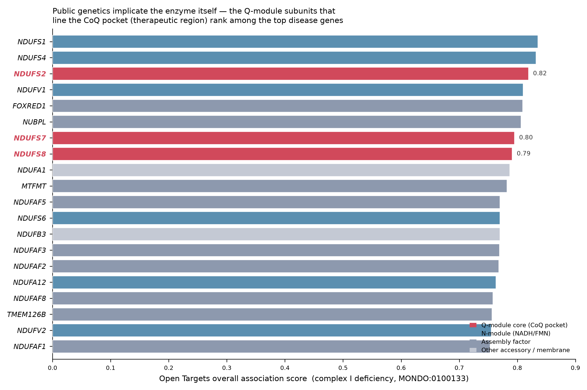
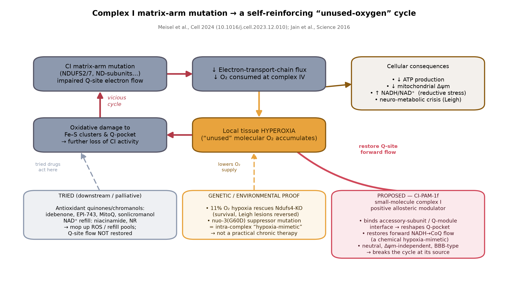
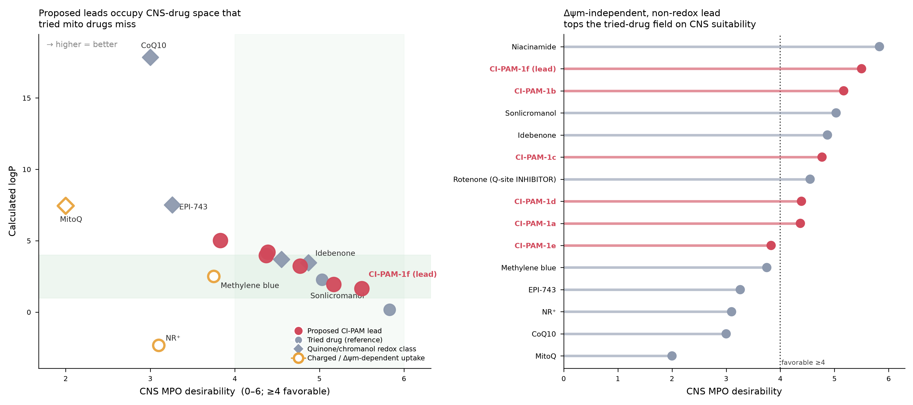
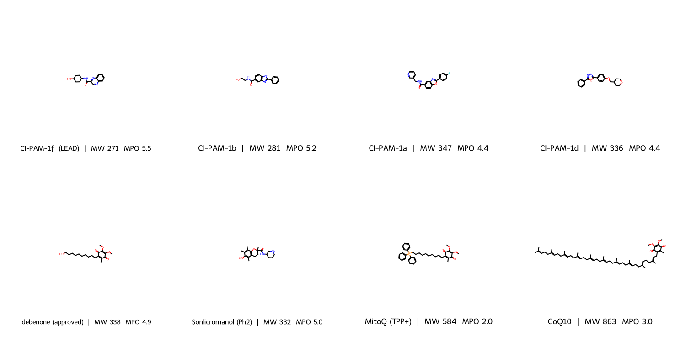

# A first-in-class complex I *positive allosteric modulator* for complex-I mitochondrial disease

> ## Bottom line
> Complex-I mitochondrial disease (Leigh syndrome, LHON) has **no approved drug**. Every
> agent tried so far — idebenone, EPI-743/vatiquinone, MitoQ, sonlicromanol, CoQ10,
> nicotinamide riboside — acts **downstream**: it mops up reactive oxygen species or
> refills the NAD⁺ pool but never repairs the enzyme's broken step. The strongest causal
> clue on record is that **hypoxia**, and a single
> intra-complex "suppressor" mutation (**NDUFA6 / _nuo-3_ G60D**), both rescue complex I
> mutants by the *same* event — reopening forward electron flow at the ubiquinone (CoQ)
> pocket. I propose the **first complex I positive allosteric modulator (CI-PAM): a small
> "chemical hypoxia-mimetic"** that reshapes the CoQ pocket to restore flux — and a concrete,
> neutral, brain-penetrant lead, **CI-PAM-1f**. **First experiment:** test whether CI-PAM-1f
> restores oxygen consumption and survival in *Ndufs4*-knockout cells and mice, the standard
> Leigh model.

---

## 1. The problem, in the public data

Complex I (NADH:ubiquinone oxidoreductase) is the largest respiratory-chain enzyme and its
deficiency is the most common cause of pediatric mitochondrial disease. Open Targets lists
**2,420 targets associated with "mitochondrial complex I deficiency" (MONDO:0100133) and zero
associated drugs.** The top-associated genes are the enzyme's own subunits and assembly factors
— NDUFS1/S2/S4/S7/S8, NDUFV1, FOXRED1, NUBPL (Figure 4). This is a disease *of the enzyme
itself*, and the genetics point squarely at it.

The clinical pipeline is small and mechanistically monotonous. A ClinicalTrials.gov audit
returns 20 interventional Leigh-syndrome trials and just 3 for complex I deficiency. The agents
recur: idebenone (the only approved mito drug, for LHON), EPI-743/vatiquinone, sonlicromanol,
CoQ10, elamipretide, nicotinamide riboside, niacinamide, rapamycin, cysteamine. **Two chemical
families dominate** — quinone/chromanol redox carriers and NAD⁺ precursors.

## 2. Why the tried drugs miss

Map the tried drugs onto what complex I loss actually does to a cell — decreased ATP, collapse
of mitochondrial membrane potential (Δψm), a rising NADH/NAD⁺ ratio, and accumulation of
**unused molecular oxygen** — and a pattern emerges (Figure 1, bottom-left). Antioxidant
quinones (idebenone, MitoQ, EPI-743) and chromanols (sonlicromanol) *scavenge the downstream
ROS*; NAD⁺ precursors (NR, niacinamide) *refill a depleted pool*. **None restores the forward
transfer of electrons from NADH to ubiquinone — the exact step the mutations break.** They
treat consequences, not cause. That is consistent with idebenone's modest, variable clinical
effect.

There is a second, quieter problem: **delivery**. The disease lowers Δψm and is
brain-predominant, yet the field's flagship agents are poorly matched to both. MitoQ is a
permanently charged triphenylphosphonium cation whose mitochondrial uptake *depends on* the very
Δψm the disease destroys; CoQ10 (cLogP ≈ 18) and EPI-743 (cLogP ≈ 7.5) are so lipophilic they
barely reach the brain. On a formal CNS drug-likeness scale (Wager CNS MPO, 0–6), MitoQ scores
**2.0**, CoQ10 **3.0**, EPI-743 **3.3** — all below the 4.0 favorability threshold (Figure 2).

## 3. The clue the public data hands us

The decisive evidence comes from three papers from the Mootha lab. In 2016 (*Science*), a
genome-wide screen found the **hypoxia response** is a potent suppressor of respiratory-chain
dysfunction, and chronic 11% O₂ dramatically extended survival and reversed brain lesions in the
*Ndufs4*-knockout Leigh mouse. In 2019 (*Cell Metabolism*) they showed the rescue works by
normalizing **brain hyperoxia** — the tissue cannot consume O₂, so "unused" oxygen accumulates
and poisons the residual enzyme — and, critically, that **HIF activation is neither necessary
nor sufficient.** This kills the obvious repurposing idea (HIF-prolyl-hydroxylase inhibitors
such as roxadustat, which are approved and were my first hypothesis): the beneficial node is not
the HIF transcriptional program.

The 2024 paper (*Cell*) closes the loop. A single accessory-subunit mutation — **_nuo-3_(G60D)
in _C. elegans_, i.e. NDUFA6 in humans** — rescues complex I mutants, and it does so by the
**same mechanism as hypoxia**: it "restores complex I forward activity, the flow of electrons
from NADH to CoQ," by **altering complex I structure around the ubiquinone binding pocket to
create a more active enzyme.** The rescue is specific to matrix-arm mutants, is HIF-independent
and ROS-independent, and requires residues in the Q-pocket. The authors name G60D a
**"hypoxia-mimetic" mutation** and describe *allosteric coupling between an accessory subunit
and the energy-conversion core.*

That is a genetic blueprint for a drug. **If a point mutation on an accessory subunit can
allosterically re-open the CoQ pocket and rescue the enzyme, a small molecule binding the same
accessory-subunit/Q-module interface should be able to do the same.**

## 4. The proposal: a complex I positive allosteric modulator ("chemical hypoxia-mimetic")

**Target:** the accessory-subunit / Q-module interface of human complex I — the NDUFA6
(P56556) / NDUFS2 (O75306) / NDUFS7 (O75251) neighborhood that shapes the ubiquinone pocket.
**Mechanism:** a **positive allosteric modulator (PAM)** that reproduces the G60D conformational
effect, subtly reshaping the Q-pocket to raise catalytic forward flux of partially defective
complex I. **Consequence:** more O₂ consumed at complex IV → local hyperoxia relieved → Δψm and
NADH/NAD⁺ restored → the vicious cycle broken **at its source** (Figure 1, red path).

**Why this is genuinely new.** ChEMBL annotates the complex I target (CHEMBL2363065) and its
subunits with *inhibitors only* — rotenone, piericidin, and hundreds of others. **There is not a
single activator or positive allosteric modulator of complex I in the database.** Complex I has
been treated for a century as something to *poison* (insecticides, cancer metabolism), never to
*potentiate*. No mito-disease trial has tested a complex I PAM; "methylene blue," the closest
electron-shuttle idea, has **zero** mitochondrial-disease trials. The concept inverts the field's
entire chemical stance toward the enzyme.

## 5. The candidate molecule: CI-PAM-1f

Design cannot yet be structure-based here (no experimental PAM co-structure exists, and this
session had no GPU for docking), so I designed to an explicit **mechanism-matched property
profile** and selected computationally. The design rules follow directly from Sections 2–4:

1. **Neutral & Δψm-independent** — must accumulate in mitochondria whose membrane potential has
   collapsed, so *no* permanent cation (unlike MitoQ).
2. **Brain-penetrant** — MW < 350, TPSA < 90, cLogP 1–4, ≤3 H-bond donors (Leigh is a
   brain disease).
3. **Not a redox quinone/chromanol** — deliberately outside the tried chemical space; the
   molecule is meant to *bind and reshape*, not to carry electrons itself.
4. **A polar "G60D-mimetic" arm** — an H-bond-donor/acceptor group (mimicking the aspartate
   introduced by G60D) presented on a rigid scaffold to engage the accessory-subunit interface.

I built six candidates and profiled them against nine reference drugs in RDKit (Figure 2,
Figure 3). The lead:

**CI-PAM-1f — _N_-(trans-4-hydroxycyclohexyl)quinoxaline-2-carboxamide**
`SMILES: O=C(NC1CCC(O)CC1)c1cnc2ccccc2n1`

| Property | CI-PAM-1f | favorable | MitoQ | CoQ10 | idebenone |
|---|---|---|---|---|---|
| MW | 271 | <450 | 584 | 863 | 338 |
| cLogP | 1.66 | 1–4 | 7.5 | 17.9 | 3.5 |
| TPSA (Ų) | 75 | <90 | 53 | 53 | 73 |
| H-bond donors | 2 | ≤3 | 0 | 0 | 1 |
| Formal charge | 0 | 0 | **+1** | 0 | 0 |
| Δψm-independent | **yes** | yes | **no** | yes | yes |
| CNS MPO (0–6) | **5.5** | ≥4 | 2.0 | 3.0 | 4.9 |
| QED | 0.87 | →1 | 0.10 | 0.05 | 0.44 |
| Lipinski violations | 0 | ≤1 | 2 | 2 | 0 |

The **quinoxaline-2-carboxamide** is a flat, rigid, weakly H-bonding heteroaromatic — a shape
complementary to the ubiquinone headgroup slot but redox-inert (it is not a quinone). The
**trans-4-hydroxycyclohexyl amide** presents the polar hydroxyl "G60D-mimetic" contact on a
defined vector while keeping the molecule neutral and lipophilic-efficient. CI-PAM-1f tops the
entire candidate panel on CNS MPO (5.5) and QED (0.87), is neutral and Δψm-independent, carries
zero Lipinski violations, and sits outside the redox space every tried drug occupies. Among all
tried drugs, only sonlicromanol shares this favorable physicochemical envelope — and it acts on
ROS/PDE, not the Q-pocket.

## 6. First experiment and validation cascade

1. **Biochemical (weeks).** Dose CI-PAM-1f (and the six-analog series) into isolated bovine/
   human complex I and into permeabilized *Ndufs4*-KO or NDUFS2-mutant fibroblasts; read
   **NADH:ubiquinone oxidoreductase rate** and Seahorse **oxygen-consumption rate**. *Success =
   dose-dependent increase in forward CI activity and OCR* (the G60D/hypoxia signature). This is
   the make-or-break go/no-go.
2. **Cellular (weeks).** In *Ndufs4*-KO cells, confirm rescue of Δψm (TMRM) and NADH/NAD⁺, and
   confirm the effect **disappears when the Q-pocket is chemically blocked** (rotenone
   competition) — the specificity control the *Cell* paper's logic predicts.
3. **Target engagement.** Cryo-EM / HDX-MS of complex I ± CI-PAM-1f to localize binding to the
   NDUFA6/Q-module interface and detect the predicted pocket reshaping; use this to launch true
   structure-based optimization.
4. **In vivo (months).** *Ndufs4*-KO Leigh mice: survival, body weight, brain-lesion MRI, and
   direct brain-tissue **pO₂** (does the drug reproduce hypoxia's normalization of hyperoxia?).

## 7. Honest limitations

- CI-PAM-1f is a **computational design hypothesis**, not a validated binder; no affinity or
  ADMET data exist yet. Its value is as a mechanism-matched, synthesizable starting point.
- The **existence of a druggable activating pocket is the central risk.** G60D proves an
  allosteric activating conformation *exists*; it does not prove a small molecule can induce it.
  Experiment 1 is designed to fail fast if not.
- Q-pocket location is argued from cryo-EM literature and the *Cell* genetics, not modeled here
  (no docking compute this session).
- A PAM will help **partial-function (hypomorphic) matrix-arm** mutations — the class hypoxia
  rescues — more than complete null or N-module/assembly-null genotypes. Patient stratification
  by genotype (readily available from the Open Targets / ClinVar landscape) is part of the plan.

**In one sentence:** the public data already contain a genetic proof that re-opening the CoQ
pocket rescues complex I disease; no one has tried to do it with a drug, and CI-PAM-1f is a
concrete, brain-penetrant, mechanism-matched way to start.
