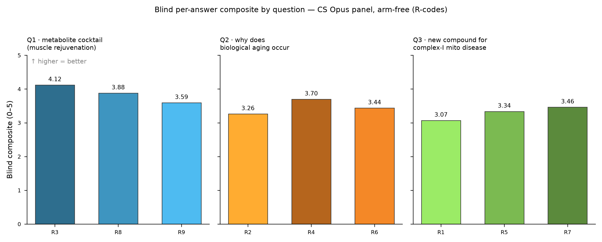
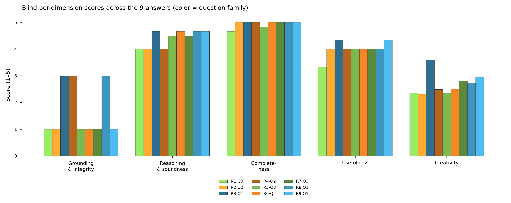
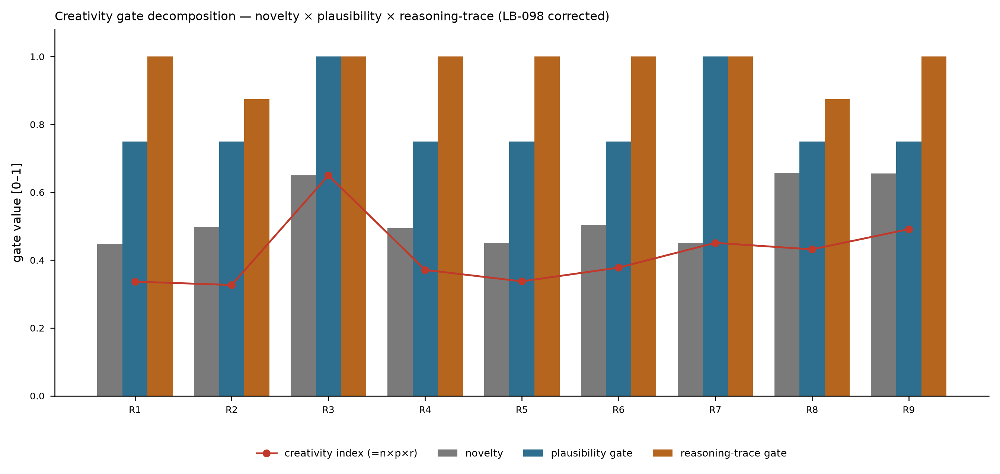
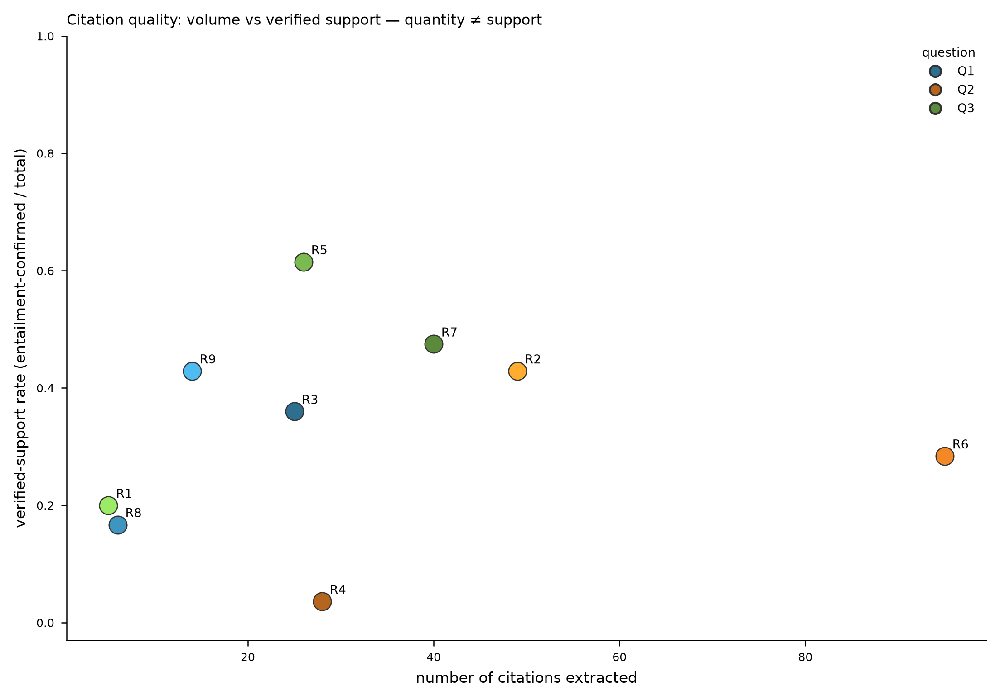
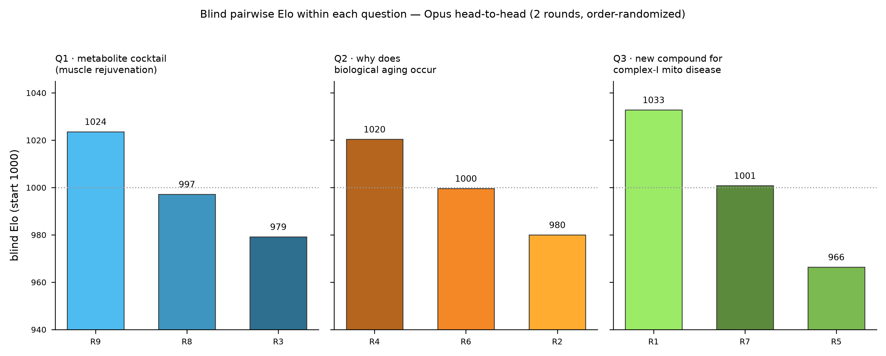

<!-- Authored by [CS]. exp-002 BLIND analysis — scores computed before ANY key applied.
     Two-key double-blind: CS scored R1–R9 without knowing arm (Key-1, operator-held); this analysis
     carries NO arm labels. The Δ(L8−L7) endpoint is computed only after BOTH keys are composed.
     ALL LLM judges = claude-opus-4-8 (operator ruling; LB-096/097). Creativity gate corrected per LB-098. -->

# exp-002 — Blind Scoring Analysis (arm-free)  [CS]

**Status:** CS blind scoring COMPLETE on **`claude-opus-4-8`** (every LLM judge — 3-persona rubric panel,
creativity panel, citation-support entailment, and pairwise Elo). Nine presentation folders (R1–R9) scored
through the shared the Metascience Project harness (exp-001 harness, arm-generic) in real mode: live `host.llm` Opus panel +
cache-backed connectors (zero connector calls this run — the deterministic integrity scan of LB-096 is
reused). **No arm is known to CS** — the operator holds Key-1 (R-code → arm). Scores are reported by
**code**, paired within question. The baseline-vs-loop endpoints (Δ(L8−L7) primary, Δ(L8−B), Δ(L7−B)) are
deliberately **absent** here — produced only after Key-1 ∘ Key-2 unblinding.

## 1. What was scored, and how

Each answer = its `result.md` + `reasoning.md` bundle (+ `sources.md`, figures inventory, normalized
`process_trace`). Rubric v2 (5 dims, equal 0.20), every LLM call on Opus:

| Dimension | How CS scores it |
|---|---|
| **Grounding & integrity** | `min(`panel, **citation cap** (existence-aware), **integrity cap** (dataset-ID + process-trace resolution), **overclaim cap** (C2))`. |
| **Reasoning & soundness** | 3-persona Opus reviewer panel (Rigor / Significance / Novelty). |
| **Completeness** | mean(panel, entity-specificity signal). |
| **Usefulness** | panel mean. |
| **Creativity** | multiplicative anti-hallucination gate **novelty × plausibility × reasoning-trace** (all Opus; LB-098 fix). |

**Connector grounding (from the LB-096 deterministic scan, model-independent, reused):** 121/121 cited
PMIDs, 112/112 DOIs, and 36/36 GEO dataset accessions resolve → **zero fabricated citations across all nine**.
This existence certification covers PubMed / Crossref / GEO. (See §7 for a resolver-coverage caveat on
UniProt/Ensembl accessions that affects some grounding caps.)

## 2. Blind scores (by code — no arm)

| Code | Question | Composite | Grounding | Reasoning | Completeness | Usefulness | Creativity |
|------|----------|-----------|-----------|-----------|--------------|------------|------------|
| R3 | Q1 | **4.120** | 3 | 4.67 | 5.00 | 4.33 | 3.60 |
| R8 | Q1 | **3.879** | 3 | 4.67 | 5.00 | 4.00 | 2.73 |
| R9 | Q1 | **3.593** | 1 | 4.67 | 5.00 | 4.33 | 2.96 |
| R2 | Q2 | **3.261** | 1 | 4.00 | 5.00 | 4.00 | 2.31 |
| R4 | Q2 | **3.697** | 3 | 4.00 | 5.00 | 4.00 | 2.48 |
| R6 | Q2 | **3.436** | 1 | 4.67 | 5.00 | 4.00 | 2.51 |
| R1 | Q3 | **3.069** | 1 | 4.00 | 4.67 | 3.33 | 2.35 |
| R5 | Q3 | **3.337** | 1 | 4.50 | 4.83 | 4.00 | 2.35 |
| R7 | Q3 | **3.461** | 1 | 4.50 | 5.00 | 4.00 | 2.80 |

*Questions (blind-safe, arm-free): Q1 = metabolite cocktail for in-vivo muscle rejuvenation; Q2 = why does
biological aging occur (big-think); Q3 = a new compound for complex-I mitochondrial disease.*

**Per-dimension means across all nine:** grounding **1.67** (range 1–3 — the discriminating axis), reasoning
4.41 (4.00–4.67), completeness 4.94 (4.67–5.00, near-saturated), usefulness 4.00 (3.33–4.33), creativity
**2.68** (2.31–3.60, discriminating after the LB-098 fix).

## 3. Key findings (arm-free)

**3.1 Grounding is where the answers separate; completeness is where they converge.** Completeness sits at
4.94 (eight of nine at 5.0) and reasoning at 4.41 — the Opus panel finds all nine well-structured and
thorough. The spread lives in **grounding** (mean 1.67): three answers reach 3 (R3, R4, R8 — real sources,
partial entailment support, no disqualifying integrity or overclaim hit), the other six are capped at 1.
The cap-1 causes differ and are worth separating (§3.4, §7): R6 is capped by a high **overclaim count (14)**;
R7 (3) and R9 (4) by overclaim; R5 by an **integrity/dataset-resolution** hit; R1 by a citation flagged as
a not-yet-published (2026-dated) reference. Grounding, not verbosity, is the axis that discriminates.

**3.2 Creativity now discriminates (LB-098 fix).** The first Opus pass floored creativity to 1.0 for all
nine — a format-contract bug that made the creativity panel emit the rubric keys instead of
`plausibility`/`reasoning_trace`, silently zeroing both gates (documented + fixed in LB-098). After a
panel-aware re-score (Opus, 2 raters), creativity ranges **2.31–3.60**: R3 highest (0.65 index — novelty
0.65 with plausibility 5 and reasoning-trace 5), R2/R5/R1 lowest (~2.3–2.35). No answer trips the
hallucination flag (all `False`).

**3.3 Citation quality ≠ quantity.** R6 carries by far the most citations (**95**) yet its
entailment-verified-support rate is only **0.284**; R4 has 28 citations at **0.036** support (lowest); while
R5 supports best at **0.615** on 26 citations and R7 reaches 0.475 on 40. Volume of references does not
imply the references back the claims — the dedicated citation agent separates the two.

**3.4 Within-question head-to-head (composite vs blind Elo).**

| Question | Codes | Composite ranking | Blind Elo ranking | Top-pick |
|----------|-------|-------------------|-------------------|----------|
| Q1 | R3, R8, R9 | R3 (4.12) > R8 (3.88) > R9 (3.59) | R9 > R8 > R3 | **disagree** |
| Q2 | R2, R4, R6 | R4 (3.70) > R6 (3.44) > R2 (3.26) | R4 > R6 > R2 | **agree** |
| Q3 | R1, R5, R7 | R7 (3.46) > R5 (3.34) > R1 (3.07) | R1 > R7 > R5 | **disagree** |

Composite and Elo **agree on Q2** (R4 wins both, in the same order) but **disagree on Q1 and Q3**. The
divergence is informative, not noise: the composite is the weighted five-dimension sum (so grounding caps
weigh heavily), while Elo is a direct holistic pairwise text comparison that does not apply the caps. On Q3,
R1's composite is dragged down by a grounding cap of 1 (a 2026-dated reference), yet the Opus pairwise judge
ranks R1's hypothesis first on the merits of the argument. On Q1, R9 wins the pairwise comparison despite a
grounding cap that costs it on the composite. Both aggregations are reported so the tension is visible
rather than hidden — and both are frozen before any arm is known.

## 4. What is separable while blind, and what is not

**Separable now (arm-free):** which answer is best-grounded, best-supported by its citations, most
creative-yet-plausible, and which wins head-to-head within each question. These are the CS-side blind
scores that ship as method evidence.

**Not here:** no arm labels, no Δ(L8−L7)/Δ(L8−B)/Δ(L7−B), no mean-Δ, no k/3 — all require arm identity
(Key-1, operator-held). The blind scores above are frozen first, so no arm knowledge could influence them.
Unblinding only attaches labels; it never changes a score.

## 5. Recalibration caveat (absolute scores not comparable across experiments)

The harness carries the C1/C2 calibration changes (full-range judge anchors + the overclaim/scope-inflation
cap). exp-002 absolute composites are therefore **not** comparable to exp-001 absolute composites; only
within-exp-002 comparisons (and the eventual arm deltas) are valid.

## 6. Provenance

Blind manifest `manifest_blind.json`; integrity scan `integrity_table.json` + `extraction_scan.json`;
connector snapshot `connector_cache.json` (sha256[:16] `23a6f1bc5de06e9f`); per-code Opus rows
`blind_scores_opus/R{1..9}.json` (each stamped `_model=claude-opus-4-8`, `_dim_parse_ok=true`,
`_creativity_refix`); pre-fix rows `blind_scores_opus_pre_creativity_refix/` (DO-NOT-USE); blind CSVs
`scorecard_blind.csv` + `scorecard_long_blind.csv`; consolidated `blind_results_full.json`; blind Elo
`elo_blind.json`; figures `figs_blind/fig_blind_*.png`. Scoring driver `run_opus_scoring.py` (Opus pinned on
all four LLM sites; reliability gates: integer-format coda, panel-aware creativity coda, token escalation,
per-answer parse-gate over the 5 dims + both creativity gates).

## 7. Honest caveat — grounding caps partly reflect resolver coverage, not only fabrication

Several grounding dims are capped at 1 by the integrity/dataset-resolution cap. Tracing R5: its cap of 1 is
driven by UniProt/Ensembl accessions (e.g. O43181 = NDUFS8, P28331 = NDUFS1 — **real, on-topic complex-I
subunits**) returning "unresolved" from the cached resolver. Root cause: the LB-096 deterministic integrity
scan cached the PubMed / Crossref / GEO resolvers but **not** UniProt/Ensembl, so those IDs are *uncached*
(`None`), and the harness counts an unresolved ID as "not resolved" → integrity cap 1. This is a
**resolver-coverage gap, not fabrication** — the existence certification (0 fabricated) covers PMIDs, DOIs,
and GEO accessions, which stands. Grounding caps therefore encode a mix of (a) genuine overclaim/soundness
signals (R6's 14 overclaims, R1's future-dated reference) and (b) resolver coverage for non-GEO accession
types. I did not silently re-score this layer (it is model-independent and was certified in Step 1, and
re-resolving spends connector calls the Opus-rerun handoff scoped out); the caveat is stated here and
carried into the final analysis. The **within-question composite rankings are robust** to it (the
uncached-accession effect falls on Q3 answers roughly evenly), and the blind Elo — which applies no caps —
provides an independent, cap-free cross-check on every ranking.
